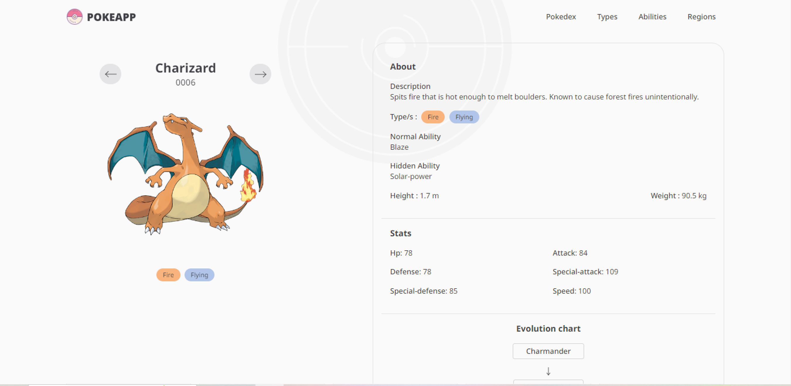
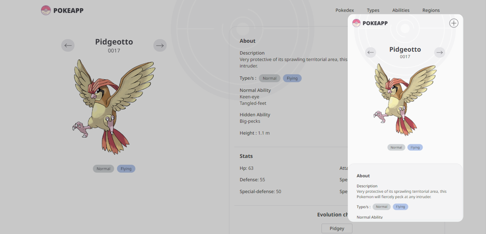

## Table of contents

. [Overview](#overview)
- [Links](#links)
- [My process](#my-process)
  - [Built with](#built-with)
  - [What I learned](#what-i-learned)
  - [Continued development](#continued-development)
- [Author](#author)

### Overview

### Responsive Design

### Links

- Live Site URL: [https://pokemon-app-puce-two.vercel.app/]

### Built with

- Semantic HTML5 markup
- CSS custom properties and classes
- CSS Grid and Flexbox
- Mobile-first workflow
- [React](https://reactjs.org/) - JS library
- [Tailwind CSS](https://tailwindcss.com/) - CSS Framework for styles
- [Next JS](https://nextjs.org/) - React Framework

### What I learned

In this project, I want to practice with the new version of Next JS 13 and some of its amazing functionalities. I had the oportunity to try the new directory system to manage routing, instead of using external libraries such as react-router-dom with React. It was simple and friendly to the developer because it depends on how you organise folders and the framework do the routing. 

Also I tried SSR components, as much as I could. It's very useful in this kind of app, which the main purprose is to show data from an API, in this case oficial Pokeapi, and render before it comes to the client. In the deploy is a fast and good option for users. 

### Continued development

The application works fine. I'm interested in working with news section, which gave me some troubles; I used an API which actually is paid (I have used it before in others projects for free), and when the deploy was ready I realised that didn't work. So one of the improvements for this app is to search a good suitable api to get pokemon news around the world about everything related to the famous industry (games, merchandaising, information, events, etc.) 

## Author

- Website - [Maximiliano Leonel Pérez](https://maxoleo-dev.vercel.app/)
- Linkedin - [Maximiliano Leonel Pérez](https://www.linkedin.com/in/maximiliano-leonel-p%C3%A9rez-8846b826a/)
